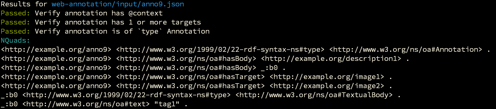

# Testing JSON-LD with JSON Schema

[](http://github.com/BigBlueHat/testing-json-ld)
[](https://www.patreon.com/BigBlueHat)

This is born out of conversations with @gkellog and @halindrome
about testing the
[Web Annotation Data Model](http://www.w3.org/TR/annotation-model/).

At present, it's a minimal gulp-based system for processing a
directory of `input` documents against a directory of `tests`.

However, we plan to hook this into some more [JSON-LD](http://json-ld.org/)
fabulousness using a meaningful manifest as input
(see [web-annotation/manifest-model.jsonld](web-annotation/manifest-model.jsonld)) for an *idea* of
what we're working toward.

The hope is to create something flexible and general enough to test
JSON-LD specifications against their various MUSTs. Short term, Web Annotation
Data Model is the focus.

## Screenshot



## Usage

Add docs to the `input` directory, and JSON Schemas to the `tests` directiory.
Then:
```
$ gulp
```

Alternatively, you can test specific diretories of each:
```
$ gulp --input=web-annotation/input/* --tests=web-annotation/tests/*
```

Or, because this is our focus (for now), you can use this `npm run` command:
```
npm run anno
```
which does the above.


### Help appreciated!

* file issues here
* join in the testing conversation at
[testdev@spec-ops.io](http://lists.spec-ops.io/listinfo.cgi/testdev-spec-ops.io)
* send me some love on the [Patreon](http://patreon.com/BigBlueHat)
